# OSH Lab01 追踪 Linux 的启动过程
##  一、实验环境
* Ubuntu 17.10 64bit
* kernel ：linux-4.15.15
* gdb 8.0.1
* busybox 1.28.1
* qemu 2.15.0
### 环境搭建
#### 内核编译
从 [kernel.org](https://www.kernel.org) 上下载 linux-4.15.15 内核源码，解压后，在本地进行编译。
>编译过程中可能会出现错误，一般而言，根据提示安装相关的缺少的包即可解决
```
cd linux-4.15.15
make clean
make oldconfig
make x86_64_defconfig #防止交叉编译
make
```
#### qemu编译
内核编译完成后，从 [qemu.org](https://www.qemu.org/) 获取 qemu 的最新版本，并编译安装。
>也可以使用 ` sudo apt install qemu`直接安装
```
make clean
make 
make install
```
#### busybox安装并制作rootfs
先安装busybox：
```
wget http://busybox.net/downloads/busybox-1.28.1.tar.bz2
make menuconfig
make
make install
```
>`menuconfig` 中要勾选 `Settings`->`Build Options`->`Build static binary (no shared libs)`

然后通过如下代码制作`rootfs.img`:
```
cd busybox-1.28.1
dd if=/dev/zero of=rootfs.img bs=1M count=10
mkfs .ext3 rootfs.img
mkdir rootfs
mount -t ext3 -o loop rootfs.img rootfs
make install CONFIG_PREFIX=rootfs
mkdir rootfs/proc rootfs/dev rootfs/etc
cp examples/bootfloppy/* rootfs/etc/ 
umount rootfs
```
>此过程中出现权限不足的情况时，通过`sudo`临时提权即可

最后将`rootfs.img`复制到 linux-4.15.15 文件夹下。
### 环境搭建相关问题
由于我的 Ubuntu 是新安装的系统，所以在搭建环境中常常出现各种包、库未安装的情况，这个时候只需要根据提示进行相应的安装即可。
## 二、使用 qemu+gdb 调试内核
### 启动 qemu
打开终端输入如下命令：
```
cd linux-4.15.15
qemu-system-x86_64 -kernel arch/x86_64/boot/bzImage -initrd rootfs.img -append "console=tty1 root=/dev/ram rdinit=/sbin/init nokaslr" -S -s  #一定要加 nokaslr 才能在之后成功设置断点
```
这个时候打开了一个没有内容的 qemu 窗口，因为我们添加了`-S`参数，使得它在刚刚启动的时候就被我们冻结。
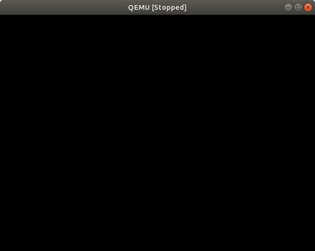 
### 启动 gdb 调试
然后另打开一个终端，进入`linux-4.15.15`，在此进行 gdb 调试：
```
gdb -tui
(gdb) file vmlinux #加载符号表
(gdb) target remote:1234
(gdb) break start_kernel #设置一个断点
(gdb) c #continue
```
这个时候 qemu 窗口就会发生变化，停留在如下界面：

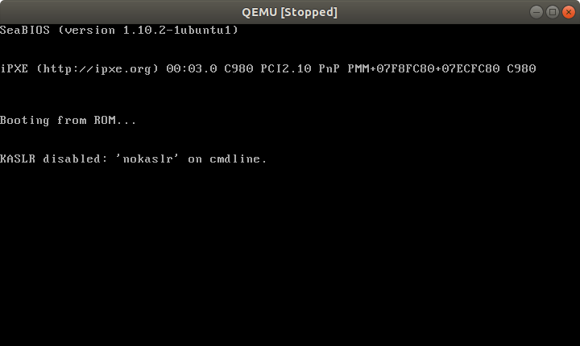 

此时，gdb 调试的终端窗口如下：

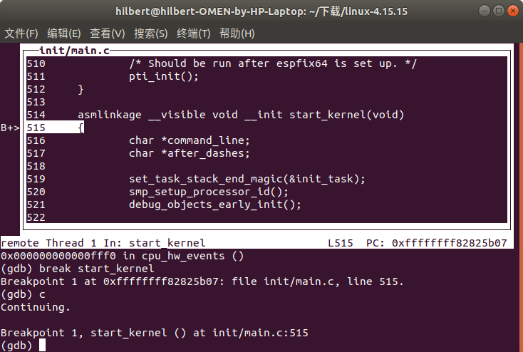 

到这里，说明断点设置成功，我们已经可以通过断点来追踪 linux 启动过程了。
## 三、Linux 开机中的关键事件
在完成内核初始化前的一些硬件相关准备工作后，`x86_64_start_reservation` 将调用`start_kernel()`，它是0号进程，所以我们先来看一下刚才找到的 start_kernel () 函数，做一下分析。
### start_kernel函数
```
asmlinkage __visible void __init start_kernel(void)
{
	char *command_line;
	char *after_dashes;

	set_task_stack_end_magic(&init_task);
	smp_setup_processor_id();
	debug_objects_early_init();

	cgroup_init_early();

	local_irq_disable();
	early_boot_irqs_disabled = true;

	/*
	 * Interrupts are still disabled. Do necessary setups, then
	 * enable them.
	 */
	boot_cpu_init();
	page_address_init();
	pr_notice("%s", linux_banner);
	setup_arch(&command_line);
	/*
	 * Set up the the initial canary and entropy after arch
	 * and after adding latent and command line entropy.
	 */
	add_latent_entropy();
	add_device_randomness(command_line, strlen(command_line));
	boot_init_stack_canary();
	mm_init_cpumask(&init_mm);
	setup_command_line(command_line);
	setup_nr_cpu_ids();
	setup_per_cpu_areas();
	boot_cpu_state_init();
	smp_prepare_boot_cpu();	/* arch-specific boot-cpu hooks */

	build_all_zonelists(NULL);
	page_alloc_init();

	pr_notice("Kernel command line: %s\n", boot_command_line);
	parse_early_param();
	after_dashes = parse_args("Booting kernel",
				  static_command_line, __start___param,
				  __stop___param - __start___param,
				  -1, -1, NULL, &unknown_bootoption);
	if (!IS_ERR_OR_NULL(after_dashes))
		parse_args("Setting init args", after_dashes, NULL, 0, -1, -1,
			   NULL, set_init_arg);

	jump_label_init();

	/*
	 * These use large bootmem allocations and must precede
	 * kmem_cache_init()
	 */
	setup_log_buf(0);
	vfs_caches_init_early();
	sort_main_extable();
	trap_init();
	mm_init();

	ftrace_init();

	/* trace_printk can be enabled here */
	early_trace_init();

	/*
	 * Set up the scheduler prior starting any interrupts (such as the
	 * timer interrupt). Full topology setup happens at smp_init()
	 * time - but meanwhile we still have a functioning scheduler.
	 */
	sched_init();
	/*
	 * Disable preemption - early bootup scheduling is extremely
	 * fragile until we cpu_idle() for the first time.
	 */
	preempt_disable();
	if (WARN(!irqs_disabled(),
		 "Interrupts were enabled *very* early, fixing it\n"))
		local_irq_disable();
	radix_tree_init();

	/*
	 * Set up housekeeping before setting up workqueues to allow the unbound
	 * workqueue to take non-housekeeping into account.
	 */
	housekeeping_init();

	/*
	 * Allow workqueue creation and work item queueing/cancelling
	 * early.  Work item execution depends on kthreads and starts after
	 * workqueue_init().
	 */
	workqueue_init_early();

	rcu_init();

	/* Trace events are available after this */
	trace_init();

	context_tracking_init();
	/* init some links before init_ISA_irqs() */
	early_irq_init();
	init_IRQ();
	tick_init();
	rcu_init_nohz();
	init_timers();
	hrtimers_init();
	softirq_init();
	timekeeping_init();
	time_init();
	sched_clock_postinit();
	printk_safe_init();
	perf_event_init();
	profile_init();
	call_function_init();
	WARN(!irqs_disabled(), "Interrupts were enabled early\n");
	early_boot_irqs_disabled = false;
	local_irq_enable();

	kmem_cache_init_late();

	/*
	 * HACK ALERT! This is early. We're enabling the console before
	 * we've done PCI setups etc, and console_init() must be aware of
	 * this. But we do want output early, in case something goes wrong.
	 */
	console_init();
	if (panic_later)
		panic("Too many boot %s vars at `%s'", panic_later,
		      panic_param);

	lockdep_info();

	/*
	 * Need to run this when irqs are enabled, because it wants
	 * to self-test [hard/soft]-irqs on/off lock inversion bugs
	 * too:
	 */
	locking_selftest();

	/*
	 * This needs to be called before any devices perform DMA
	 * operations that might use the SWIOTLB bounce buffers. It will
	 * mark the bounce buffers as decrypted so that their usage will
	 * not cause "plain-text" data to be decrypted when accessed.
	 */
	mem_encrypt_init();

#ifdef CONFIG_BLK_DEV_INITRD
	if (initrd_start && !initrd_below_start_ok &&
	    page_to_pfn(virt_to_page((void *)initrd_start)) < min_low_pfn) {
		pr_crit("initrd overwritten (0x%08lx < 0x%08lx) - disabling it.\n",
		    page_to_pfn(virt_to_page((void *)initrd_start)),
		    min_low_pfn);
		initrd_start = 0;
	}
#endif
	page_ext_init();
	kmemleak_init();
	debug_objects_mem_init();
	setup_per_cpu_pageset();
	numa_policy_init();
	acpi_early_init();
	if (late_time_init)
		late_time_init();
	calibrate_delay();
	pid_idr_init();
	anon_vma_init();
#ifdef CONFIG_X86
	if (efi_enabled(EFI_RUNTIME_SERVICES))
		efi_enter_virtual_mode();
#endif
	thread_stack_cache_init();
	cred_init();
	fork_init();
	proc_caches_init();
	buffer_init();
	key_init();
	security_init();
	dbg_late_init();
	vfs_caches_init();
	pagecache_init();
	signals_init();
	proc_root_init();
	nsfs_init();
	cpuset_init();
	cgroup_init();
	taskstats_init_early();
	delayacct_init();

	check_bugs();

	acpi_subsystem_init();
	arch_post_acpi_subsys_init();
	sfi_init_late();

	if (efi_enabled(EFI_RUNTIME_SERVICES)) {
		efi_free_boot_services();
	}

	/* Do the rest non-__init'ed, we're now alive */
	rest_init();
}

/* Call all constructor functions linked into the kernel. */
```
可以看到，`start_kernel () `函数里面调用了很多的 `_init`类型的初始化函数。它的主要功能就是完成内核的初始化并启动祖先进程。那么，我们来追踪一下这些初始化函数
#### set_task_stack_end_magic(&init_task) 函数
```
(gdb)break set_task_stack_end_magic
(gdb)c
```
追踪到该函数：
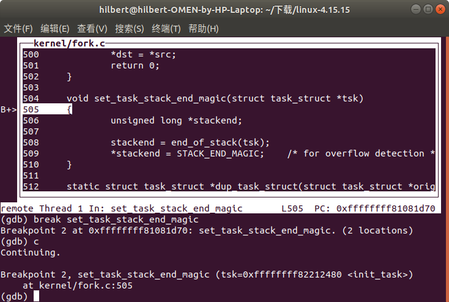 
代码如下：
```
set_task_stack_end_magic(struct task_struct *tsk)
{
	unsigned long *stackend;
  stackend = end_of_stack(tsk);
  *stackend = STACK_END_MAGIC;	/* for overflow detection */
}
```
它设置了一个栈，并且设置了栈底来防止溢出。
#### smp_setup_processor_id() 函数
接下来使用同样的设置断点的方法，追踪到`smp_setup_processor_id()` 函数
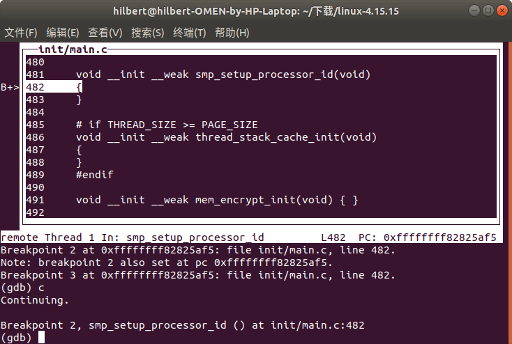 
这个函数是用来设置 SMP 模型的 CPU 参数
#### debug_objects_early_init() 函数
在设置断点时发现找不到这个函数
#### cgroup_init_early() 函数
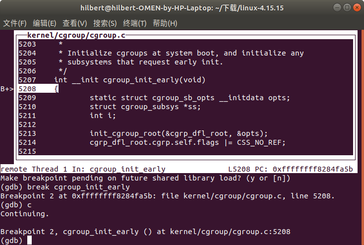 
这里将初始化 control groups ，并且初始化任何需要 early init 的子系统
#### boot_cpu_init() 函数
在做完之前的初始化后，interrupts 依然不可用，这里将做一些必要的设置，使得interrupts 可用
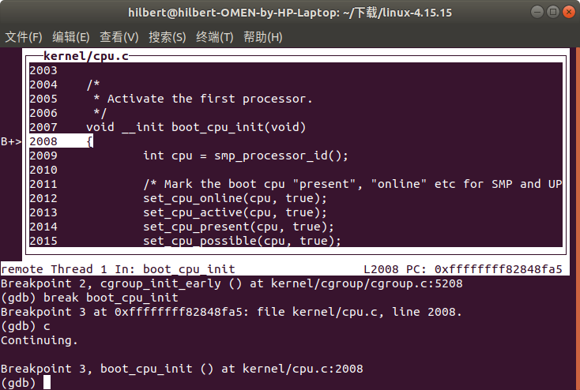 
```
static void __init boot_cpu_init(void)
{
	int cpu = smp_processor_id();
	/* Mark the boot cpu "present", "online" etc for SMP and UP case */
	set_cpu_online(cpu, true);
	set_cpu_active(cpu, true);
	set_cpu_present(cpu, true);
	set_cpu_possible(cpu, true);
}
```
该函数激活第一个 CPU，取得它的 ID，然后将它标记为 `present`、`online`、`active`、`possible`。
#### pr_notice("%s", linux_banner) 函数
我设置断点时没有找到这个函数，但分析并查找资料后知道这里是打印版本信息在屏幕上。
#### setup_arch(&command_line) 函数
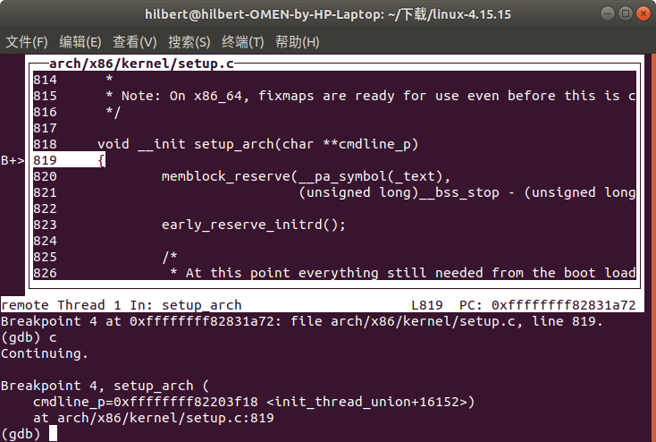 
这个函数是进行体系结构的初始化，定义在`arch/x86/kernel/setup.c`中。
`start_kernel`是一个通用的内核启动函数，但是在初始化过程中，有一些参数是依赖与硬件体系结构的，这些依赖于特定的硬件体系结构的设置就通过`setup_arch`来完成。
#### trap_init() 函数
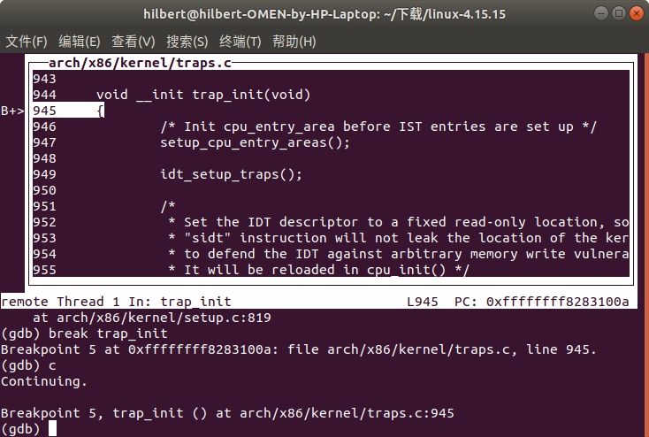 
`trap_init`是初始化硬件中断的函数，它被定义在`arch/x86/kernel/traps.c` 中，用于构建一些中断。
#### mm_init() 函数
`mm_init`被定义在`main.c`中，主要是用于内存的初始化
#### sched_init() 函数
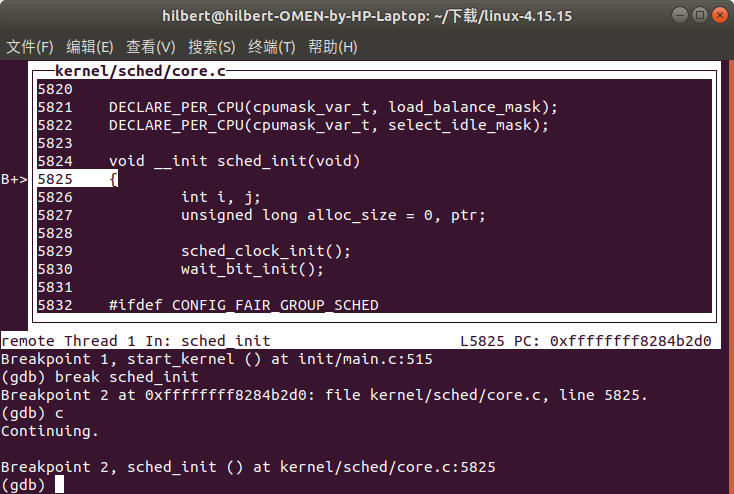 
`sched_init`是一个比较重要的函数，它主要用于对调度器进行初始化，主要工作为：

+ 对相关数据结构分配内存
+ 初始化`root_task_group`
+ 初始化每个 CPU 的 rq 队列（包括其中的 cfs 队列和实时进程队列）
+ 将`init_task`进程转变为 idle 进程

#### console_init() 函数
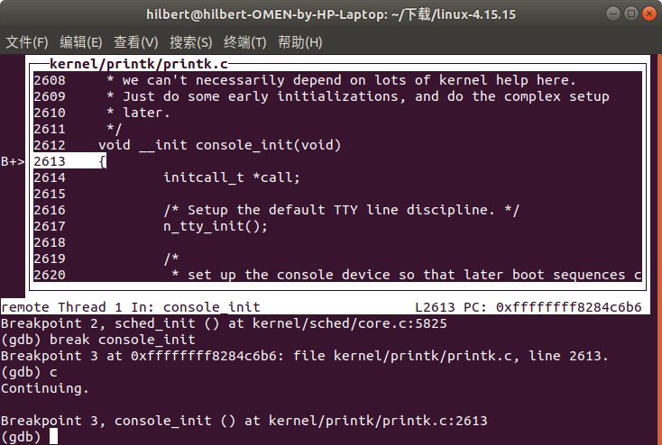 
用于初始化控制台
#### rest_init() 函数
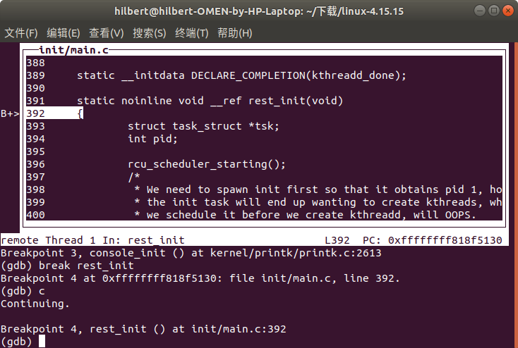 
这是`start_kernel`调用的最后一个函数，完成剩下的内核初始化。
它会调用 `kernel_thread`创建1号进程`kernel_init`和2号进程`kthreadd`。
### 启动完成
到这里内核的初始化就完成了，之后转入用户空间的初始化
## 四、总结
* 本次实验主要通过分析`start_kernel`函数来寻找 linux 内核在启动过程中的关键时间，这是不完全、不充分的。
* `rootfs`制作上还有一些问题，内核启动后用户空间初始化失败在了 `mount root fs`上。
## 五、参考文献
* [linux内核学习之三 跟踪分析内核的启动过程](https://www.cnblogs.com/-flw/p/5268100.html)
* [Linux Kernel 内核编译安装](http://edwin-wang.com/2011/09/%E3%80%90%E8%BD%AC%E3%80%91linux-kernel-%E5%86%85%E6%A0%B8%E7%BC%96%E8%AF%91%E5%AE%89%E8%A3%85/)
